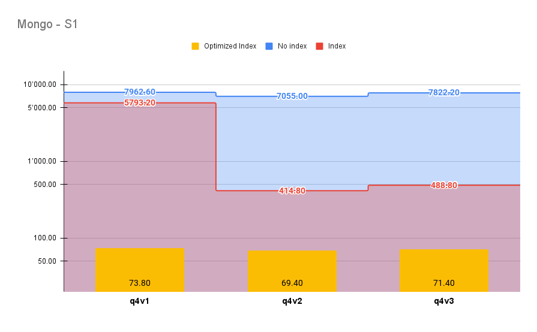
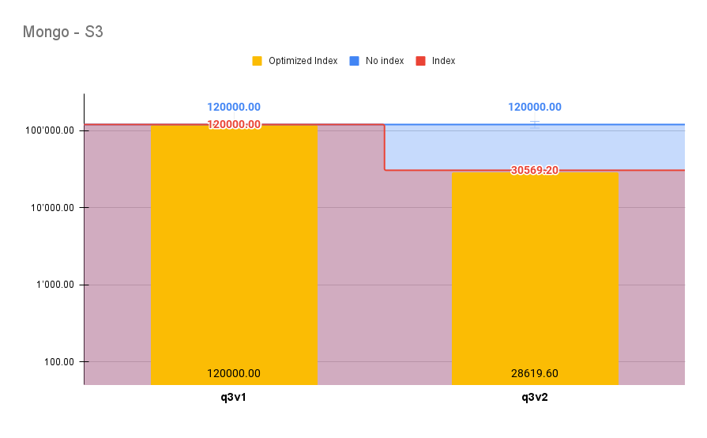
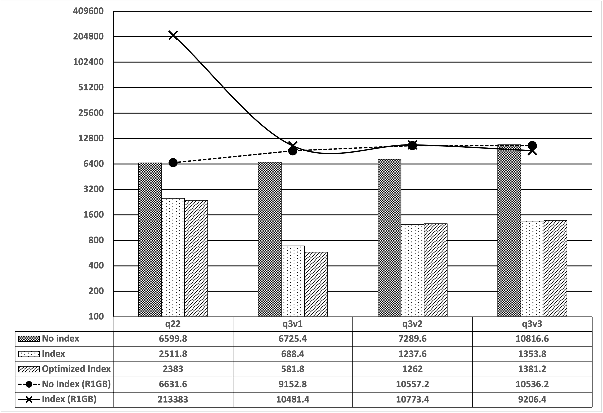
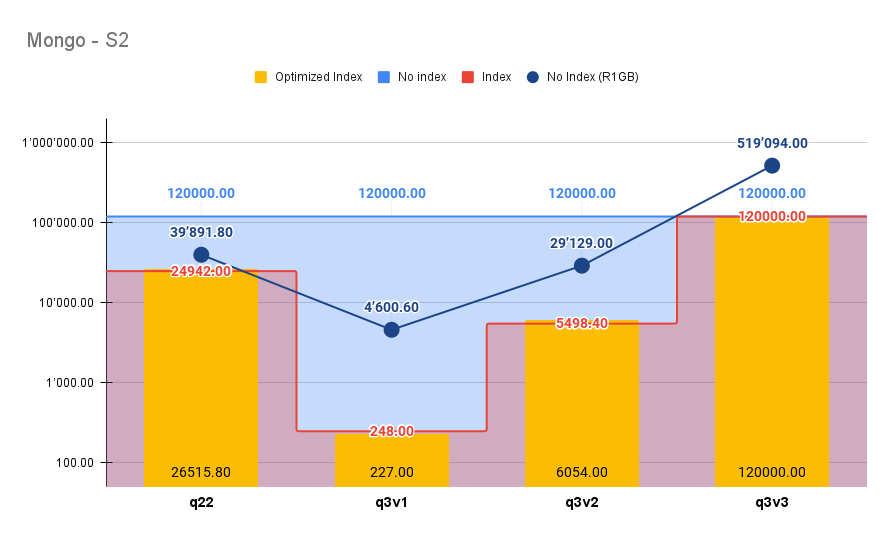
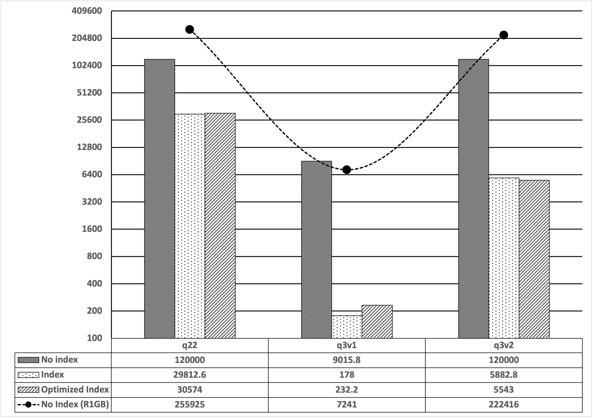
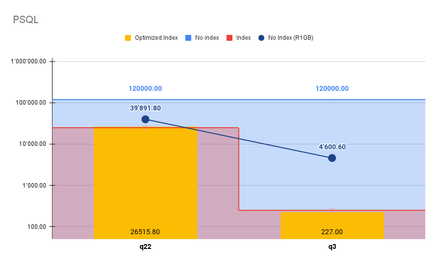

# Evaluation

This file contains notes on the evaluation of UDO.

Experiments:
- [No index](../01_experiments/no-index)
- [Index](../01_experiments/index)
- [Optimized Index](../01_experiments/optim)
- [R1GB](../01_experiments/ref)

## Point Queries Experiments

The following table shows all values in milliseconds.  
R1GB refers to the experiments conducted by Llano-Ríos et al.
Total is calculated without PostgreSQL values.
```
+----------+---------+-------+----------+----------+-----------------+-----------------+--------------+
| Database | Dataset | Query | No index | Index    | Optimized Index | No Index (R1GB) | Index (R1GB) |
+----------+---------+-------+----------+----------+-----------------+-----------------+--------------+
| mongo    | s1      | q22   | 6599.8   | 2511.8   | 2383            | 6631.6          | 213383       |
+----------+---------+-------+----------+----------+-----------------+-----------------+--------------+
| mongo    | s1      | q3v1  | 6725.4   | 688.4    | 581.8           | 9152.8          | 10481.4      |
+----------+---------+-------+----------+----------+-----------------+-----------------+--------------+
| mongo    | s1      | q3v2  | 7289.6   | 1237.6   | 1262            | 10557.2         | 10773.4      |
+----------+---------+-------+----------+----------+-----------------+-----------------+--------------+
| mongo    | s1      | q3v3  | 10816.6  | 1353.8   | 1381.2          | 10536.2         | 9206.4       |
+----------+---------+-------+----------+----------+-----------------+-----------------+--------------+
|          |         |       |          |          |                 |                 |              |
+----------+---------+-------+----------+----------+-----------------+-----------------+--------------+
| mongo    | s2      | q22   | 120000   | 24942    | 26515.8         | 39891.8         |              |
+----------+---------+-------+----------+----------+-----------------+-----------------+--------------+
| mongo    | s2      | q3v1  | 120000   | 248      | 227             | 4600.6          |              |
+----------+---------+-------+----------+----------+-----------------+-----------------+--------------+
| mongo    | s2      | q3v2  | 120000   | 5498.4   | 6054            | 29129           |              |
+----------+---------+-------+----------+----------+-----------------+-----------------+--------------+
| mongo    | s2      | q3v3  | 120000   | 120000   | 120000          | 519094          |              |
+----------+---------+-------+----------+----------+-----------------+-----------------+--------------+
|          |         |       |          |          |                 |                 |              |
+----------+---------+-------+----------+----------+-----------------+-----------------+--------------+
| mongo    | s3      | q22   | 120000   | 29812.6  | 30574           | 255925          |              |
+----------+---------+-------+----------+----------+-----------------+-----------------+--------------+
| mongo    | s3      | q3v1  | 9015.8   | 178      | 232.2           | 7241            |              |
+----------+---------+-------+----------+----------+-----------------+-----------------+--------------+
| mongo    | s3      | q3v2  | 120000   | 5882.8   | 5543            | 222416          |              |
+----------+---------+-------+----------+----------+-----------------+-----------------+--------------+
|          |         |       |          |          |                 |                 |              |
+----------+---------+-------+----------+----------+-----------------+-----------------+--------------+
| psql     |         | q22   | 979.73   |          |                 | 320.75          | 1188.48      |
+----------+---------+-------+----------+----------+-----------------+-----------------+--------------+
| psql     |         | q3    |          | 497.68   |                 | 6271.23         | 6053.99      |
+----------+---------+-------+----------+----------+-----------------+-----------------+--------------+
| Total    |         |       | 760447.2 | 192353.4 | 194754          | 1115175.2       |              |
+----------+---------+-------+----------+----------+-----------------+-----------------+--------------+                                              |
```

Point queries experiment according to the research work:

T. F. Llano-Ríos, M. Khalefa and A. Badia, "Evaluating NoSQL Systems for Decision Support: An Experimental Approach," 2020 IEEE International Conference on Big Data (Big Data), 2020, pp. 2802-2811, doi: 10.1109/BigData50022.2020.9377881.

DOI: [10.1109/BigData50022.2020.9377881](https://doi.org/10.1109/BigData50022.2020.9377881)

### Point Queries Experiment S1
[](https://docs.google.com/spreadsheets/d/e/2PACX-1vROFlzPXS8bckwC4oAGMKQNk4HrmGX28nE46sY4vd53UkBeXdVAK3HQaSDR730dtGs9nIlpO2XtDBvC/pubchart?oid=401580007&format=interactive)

### Point Queries Experiment S2
[](https://docs.google.com/spreadsheets/d/e/2PACX-1vROFlzPXS8bckwC4oAGMKQNk4HrmGX28nE46sY4vd53UkBeXdVAK3HQaSDR730dtGs9nIlpO2XtDBvC/pubchart?oid=432723154&format=interactive)

### Point Queries Experiment S3
[](https://docs.google.com/spreadsheets/d/e/2PACX-1vROFlzPXS8bckwC4oAGMKQNk4HrmGX28nE46sY4vd53UkBeXdVAK3HQaSDR730dtGs9nIlpO2XtDBvC/pubchart?oid=13547399&format=interactive)

### Point Query PSQL
[](https://docs.google.com/spreadsheets/d/e/2PACX-1vROFlzPXS8bckwC4oAGMKQNk4HrmGX28nE46sY4vd53UkBeXdVAK3HQaSDR730dtGs9nIlpO2XtDBvC/pubchart?oid=959957231&format=interactive)

## TPC-H Experiments

The following table shows all values in milliseconds.  
R1GB refers to the experiments conducted by Llano-Ríos et al.
Total is calculated without PostgreSQL values.
```
+----------+---------+-------+----------+----------+-----------------+-----------------+--------------+
| Database | Dataset | Query | No index | Index    | Optimized Index | No Index (R1GB) | Index (R1GB) |
+----------+---------+-------+----------+----------+-----------------+-----------------+--------------+
| mongo    | s1      | q22   | 6599.8   | 2511.8   | 2383            | 6631.6          | 213383       |
+----------+---------+-------+----------+----------+-----------------+-----------------+--------------+
| mongo    | s1      | q3v1  | 6725.4   | 688.4    | 581.8           | 9152.8          | 10481.4      |
+----------+---------+-------+----------+----------+-----------------+-----------------+--------------+
| mongo    | s1      | q3v2  | 7289.6   | 1237.6   | 1262            | 10557.2         | 10773.4      |
+----------+---------+-------+----------+----------+-----------------+-----------------+--------------+
| mongo    | s1      | q3v3  | 10816.6  | 1353.8   | 1381.2          | 10536.2         | 9206.4       |
+----------+---------+-------+----------+----------+-----------------+-----------------+--------------+
|          |         |       |          |          |                 |                 |              |
+----------+---------+-------+----------+----------+-----------------+-----------------+--------------+
| mongo    | s2      | q22   | 120000   | 24942    | 26515.8         | 39891.8         |              |
+----------+---------+-------+----------+----------+-----------------+-----------------+--------------+
| mongo    | s2      | q3v1  | 120000   | 248      | 227             | 4600.6          |              |
+----------+---------+-------+----------+----------+-----------------+-----------------+--------------+
| mongo    | s2      | q3v2  | 120000   | 5498.4   | 6054            | 29129           |              |
+----------+---------+-------+----------+----------+-----------------+-----------------+--------------+
| mongo    | s2      | q3v3  | 120000   | 120000   | 120000          | 519094          |              |
+----------+---------+-------+----------+----------+-----------------+-----------------+--------------+
|          |         |       |          |          |                 |                 |              |
+----------+---------+-------+----------+----------+-----------------+-----------------+--------------+
| mongo    | s3      | q22   | 120000   | 29812.6  | 30574           | 255925          |              |
+----------+---------+-------+----------+----------+-----------------+-----------------+--------------+
| mongo    | s3      | q3v1  | 9015.8   | 178      | 232.2           | 7241            |              |
+----------+---------+-------+----------+----------+-----------------+-----------------+--------------+
| mongo    | s3      | q3v2  | 120000   | 5882.8   | 5543            | 222416          |              |
+----------+---------+-------+----------+----------+-----------------+-----------------+--------------+
|          |         |       |          |          |                 |                 |              |
+----------+---------+-------+----------+----------+-----------------+-----------------+--------------+
| psql     |         | q22   | 979.73   |          |                 | 320.75          | 1188.48      |
+----------+---------+-------+----------+----------+-----------------+-----------------+--------------+
| psql     |         | q3    |          | 497.68   |                 | 6271.23         | 6053.99      |
+----------+---------+-------+----------+----------+-----------------+-----------------+--------------+
| Total    |         |       | 760447.2 | 192353.4 | 194754          | 1115175.2       |              |
+----------+---------+-------+----------+----------+-----------------+-----------------+--------------+
```

TPC-H experiment according to the research work:

T. F. Llano-Ríos, M. Khalefa and A. Badia, "Evaluating NoSQL Systems for Decision Support: An Experimental Approach," 2020 IEEE International Conference on Big Data (Big Data), 2020, pp. 2802-2811, doi: 10.1109/BigData50022.2020.9377881.

URL: https://ieeexplore.ieee.org/stamp/stamp.jsp?tp=&arnumber=9377881&isnumber=9377728

### TPC-H Experiment S1
[](https://docs.google.com/spreadsheets/d/e/2PACX-1vROFlzPXS8bckwC4oAGMKQNk4HrmGX28nE46sY4vd53UkBeXdVAK3HQaSDR730dtGs9nIlpO2XtDBvC/pubchart?oid=347322553&format=interactive)

### TPC-H Experiment S2
[](https://docs.google.com/spreadsheets/d/e/2PACX-1vROFlzPXS8bckwC4oAGMKQNk4HrmGX28nE46sY4vd53UkBeXdVAK3HQaSDR730dtGs9nIlpO2XtDBvC/pubchart?oid=1644106314&format=interactive)

### TPC-H Experiment S3
[](https://docs.google.com/spreadsheets/d/e/2PACX-1vROFlzPXS8bckwC4oAGMKQNk4HrmGX28nE46sY4vd53UkBeXdVAK3HQaSDR730dtGs9nIlpO2XtDBvC/pubchart?oid=1083337445&format=interactive)

### TPC-H PSQL
[](https://docs.google.com/spreadsheets/d/e/2PACX-1vROFlzPXS8bckwC4oAGMKQNk4HrmGX28nE46sY4vd53UkBeXdVAK3HQaSDR730dtGs9nIlpO2XtDBvC/pubchart?oid=254369509&format=interactive)


