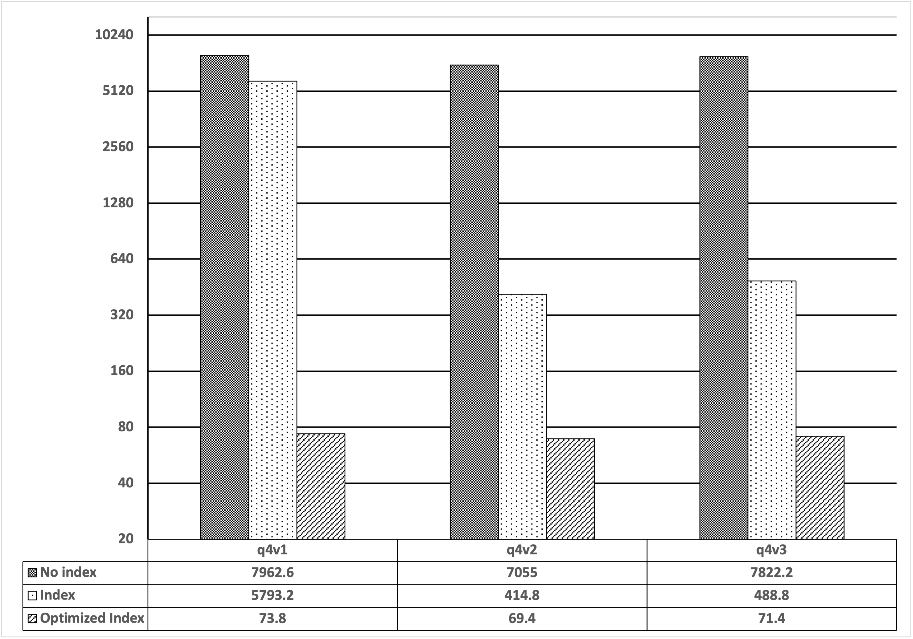
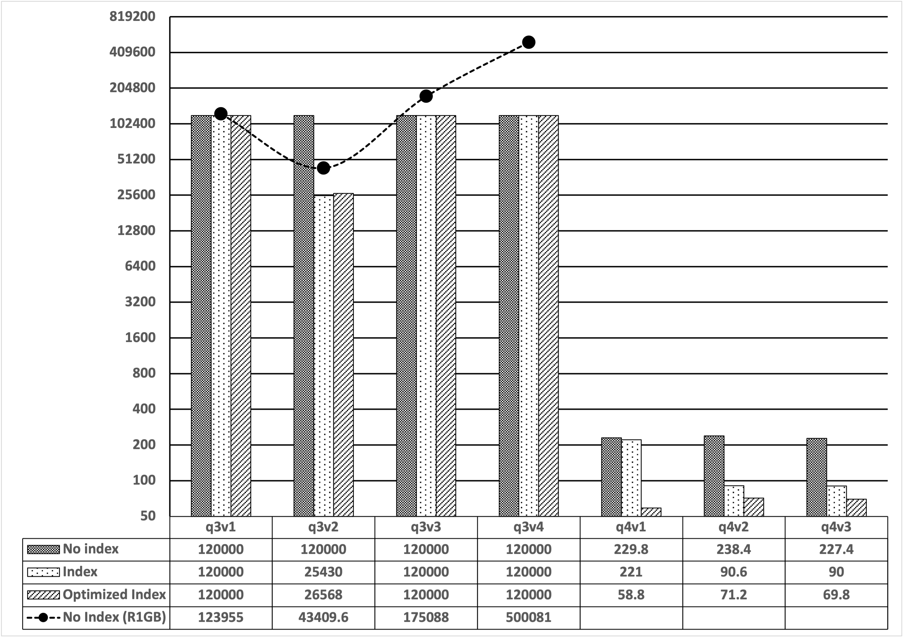
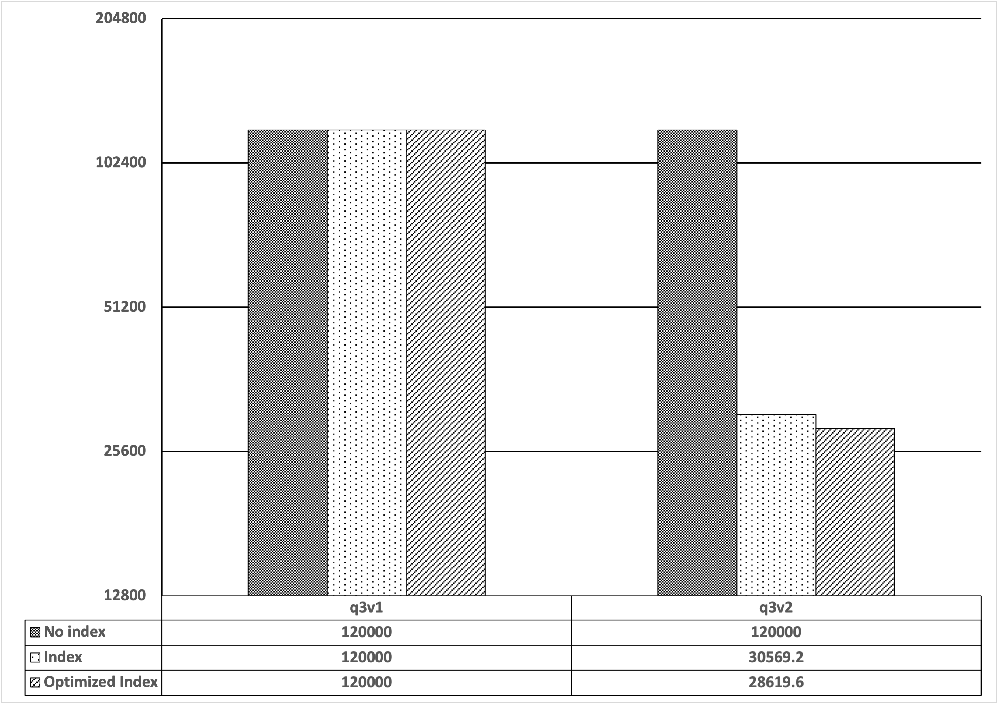
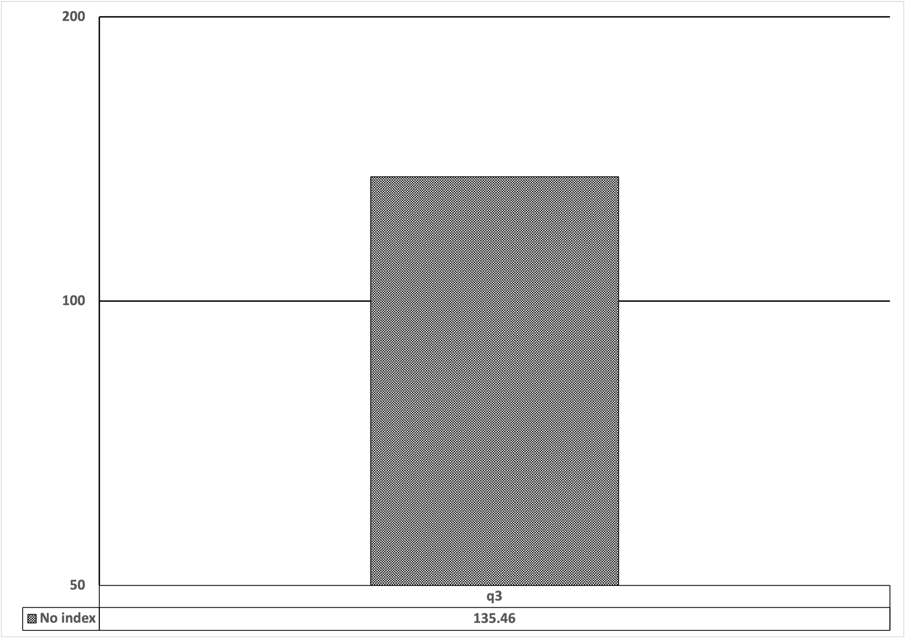
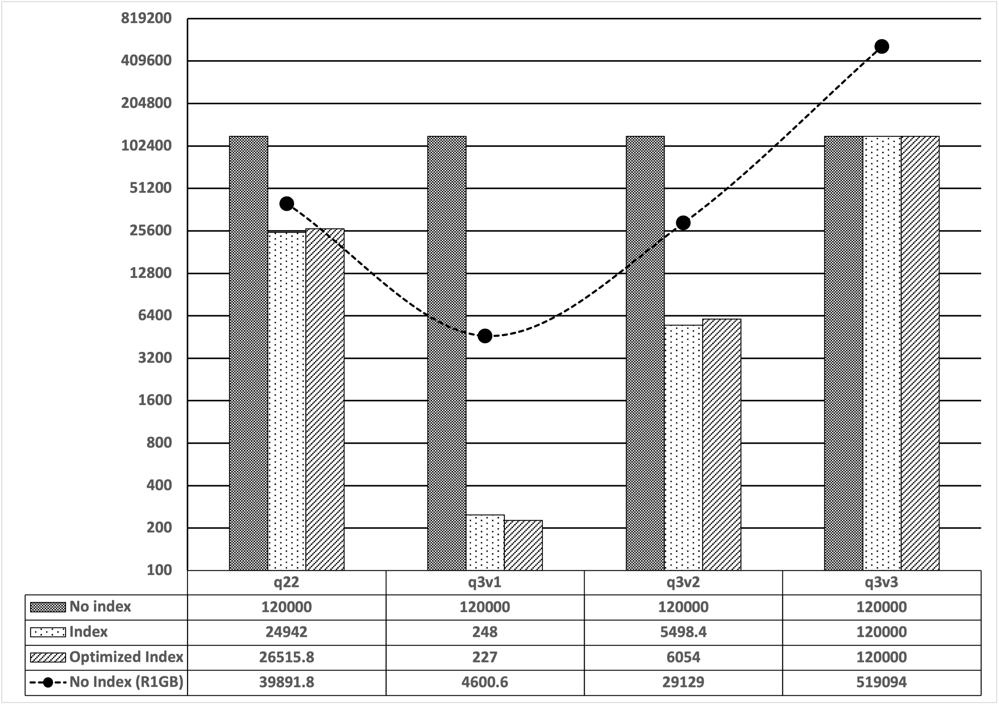

# Optimization

This file contains notes on optimization of UDO.

## Point Queries Experiments


```
|          |         |       |        Default       |    Optimized    |           Reference 1GB        |
|----------|---------|-------|----------|-----------|-----------------|-----------------|--------------|
| Database | Dataset | Query | No index | Index     | Optimized Index | No Index (R1GB) | Index (R1GB) |
|----------|---------|-------|----------|-----------|-----------------|-----------------|--------------|
| mongo    | s1      | q4v1  | 7962.6   | 5793.2    | 73.8            |                 |              |
| mongo    | s1      | q4v2  | 7055     | 414.8     | 69.4            |                 |              |
| mongo    | s1      | q4v3  | 7822.2   | 488.8     | 71.4            |                 |              |
|          |         |       |          |           |                 |                 |              |
| mongo    | s2      | q3v1  | 120000   | 120000    | 120000          | 500081          |              |
| mongo    | s2      | q3v2  | 120000   | 120000    | 120000          | 175088          |              |
| mongo    | s2      | q3v3  | 120000   | 120000    | 120000          | 123955          |              |
| mongo    | s2      | q3v4  | 120000   | 25430     | 26568           | 43409.6         |              |
| mongo    | s2      | q4v1  | 229.8    | 221       | 58.8            |                 |              |
| mongo    | s2      | q4v2  | 238.4    | 90.6      | 71.2            |                 |              |
| mongo    | s2      | q4v3  | 227.4    | 90        | 69.8            |                 |              |
|          |         |       |          |           |                 |                 |              |
| mongo    | s3      | q3v1  | 120000   | 120000    | 120000          |                 |              |
| mongo    | s3      | q3v2  | 120000   | 30569.2   | 28619.6         |                 |              |
|          |         |       |          |           |                 |                 |              |
| psql     |         | q3    | 120000   | 30569.2   | 28619.6         |                 |              |
|----------|---------|-------|----------|-----------|-----------------|-----------------|--------------|
| Total                        217543.4   1159667.6                                                    |
```

Point queries experiment according to the research work:

T. F. Llano-Ríos, M. Khalefa and A. Badia, "Evaluating NoSQL Systems for Decision Support: An Experimental Approach," 2020 IEEE International Conference on Big Data (Big Data), 2020, pp. 2802-2811, doi: 10.1109/BigData50022.2020.9377881.

Abstract: We design and implement an experimental analysis comparing two relational systems (PostgreSQL and MariaDB) and two document-based NoSQL systems (MongoDB and CouchBase). We compare their performance on a single server, Decision Support (DSS) scenario. We argue that DSS is becoming an important case study for NoSQL. We experiment with several database designs and several query translations in order to investigate the effect of physical design and query optimization in document-based stores. Our results show that design is very important for MongoDB's performance, and that query optimization over documents is much less sophisticated on document-based stores than in relational data bases and needs to improve. Our results also offer some ideas to guide further development in this area.

DOI: [10.1109/BigData50022.2020.9377881](https://doi.org/10.1109/BigData50022.2020.9377881)

### Point Queries Experiment S1
[](https://docs.google.com/spreadsheets/d/e/2PACX-1vROFlzPXS8bckwC4oAGMKQNk4HrmGX28nE46sY4vd53UkBeXdVAK3HQaSDR730dtGs9nIlpO2XtDBvC/pubchart?oid=401580007&format=interactive)

### Point Queries Experiment S2
[](https://docs.google.com/spreadsheets/d/e/2PACX-1vROFlzPXS8bckwC4oAGMKQNk4HrmGX28nE46sY4vd53UkBeXdVAK3HQaSDR730dtGs9nIlpO2XtDBvC/pubchart?oid=432723154&format=interactive)

### Point Queries Experiment S3
[](https://docs.google.com/spreadsheets/d/e/2PACX-1vROFlzPXS8bckwC4oAGMKQNk4HrmGX28nE46sY4vd53UkBeXdVAK3HQaSDR730dtGs9nIlpO2XtDBvC/pubchart?oid=13547399&format=interactive)

### Point Query PSQL
[](https://docs.google.com/spreadsheets/d/e/2PACX-1vROFlzPXS8bckwC4oAGMKQNk4HrmGX28nE46sY4vd53UkBeXdVAK3HQaSDR730dtGs9nIlpO2XtDBvC/pubchart?oid=959957231&format=interactive)

## TPC-H Experiments

```
|          |         |       |        Default       |    Optimized    |           Reference 1GB        |
|----------|---------|-------|-----------|----------|-----------------|-----------------|--------------|
| Database | Dataset | Query | No index  | Index    | Optimized Index | No Index (R1GB) | Index (R1GB) |
|----------|---------|-------|-----------|----------|-----------------|-----------------|--------------|
| mongo    | s1      | q22   | 6599.8    | 2511.8   | 2383            | 6631.6          | 213383       |
| mongo    | s1      | q3v1  | 6725.4    | 688.4    | 581.8           | 9152.8          | 10481.4      |
| mongo    | s1      | q3v2  | 7289.6    | 1237.6   | 1262            | 10557.2         | 10773.4      |
| mongo    | s1      | q3v3  | 10816.6   | 1353.8   | 1381.2          | 10536.2         | 9206.4       |
|          |         |       |           |          |                 |                 |              |
| mongo    | s2      | q22   | 120000    | 24942    | 26515.8         | 39891.8         |              |
| mongo    | s2      | q3v1  | 120000    | 248      | 227             | 4600.6          |              |
| mongo    | s2      | q3v2  | 120000    | 5498.4   | 6054            | 29129           |              |
| mongo    | s2      | q3v3  | 120000    | 120000   | 120000          | 519094          |              |
|          |         |       |           |          |                 |                 |              |
| mongo    | s3      | q22   | 120000    | 29812.6  | 30574           | 255925          |              |
| mongo    | s3      | q3v1  | 9015.8    | 178      | 232.2           | 7241            |              |
| mongo    | s3      | q3v2  | 120000    | 5882.8   | 5543            | 222416          |              |
|          |         |       |           |          |                 |                 |              |
| psql     |         | q22   | 120000    | 24942    | 26515.8         | 39891.8         |              |
| psql     |         | q3    | 120000    | 248      | 227             | 4600.6          |              |
|----------|---------|-------|-----------|----------|-----------------|-----------------|--------------|
| Total                        1000447.2   217543.4   221496.8          1159667.6                      |
```

TPC-H experiment according to the research work:

T. F. Llano-Ríos, M. Khalefa and A. Badia, "Evaluating NoSQL Systems for Decision Support: An Experimental Approach," 2020 IEEE International Conference on Big Data (Big Data), 2020, pp. 2802-2811, doi: 10.1109/BigData50022.2020.9377881.

Abstract: We design and implement an experimental analysis comparing two relational systems (PostgreSQL and MariaDB) and two document-based NoSQL systems (MongoDB and CouchBase). We compare their performance on a single server, Decision Support (DSS) scenario. We argue that DSS is becoming an important case study for NoSQL. We experiment with several database designs and several query translations in order to investigate the effect of physical design and query optimization in document-based stores. Our results show that design is very important for MongoDB's performance, and that query optimization over documents is much less sophisticated on document-based stores than in relational data bases and needs to improve. Our results also offer some ideas to guide further development in this area.

URL: https://ieeexplore.ieee.org/stamp/stamp.jsp?tp=&arnumber=9377881&isnumber=9377728

### TPC-H Experiment S1
[](https://docs.google.com/spreadsheets/d/e/2PACX-1vROFlzPXS8bckwC4oAGMKQNk4HrmGX28nE46sY4vd53UkBeXdVAK3HQaSDR730dtGs9nIlpO2XtDBvC/pubchart?oid=347322553&format=interactive)

### TPC-H Experiment S2
[](https://docs.google.com/spreadsheets/d/e/2PACX-1vROFlzPXS8bckwC4oAGMKQNk4HrmGX28nE46sY4vd53UkBeXdVAK3HQaSDR730dtGs9nIlpO2XtDBvC/pubchart?oid=1644106314&format=interactive)

### TPC-H Experiment S3
[](https://docs.google.com/spreadsheets/d/e/2PACX-1vROFlzPXS8bckwC4oAGMKQNk4HrmGX28nE46sY4vd53UkBeXdVAK3HQaSDR730dtGs9nIlpO2XtDBvC/pubchart?oid=1083337445&format=interactive)

### TPC-H PSQL
[](https://docs.google.com/spreadsheets/d/e/2PACX-1vROFlzPXS8bckwC4oAGMKQNk4HrmGX28nE46sY4vd53UkBeXdVAK3HQaSDR730dtGs9nIlpO2XtDBvC/pubchart?oid=254369509&format=interactive)


